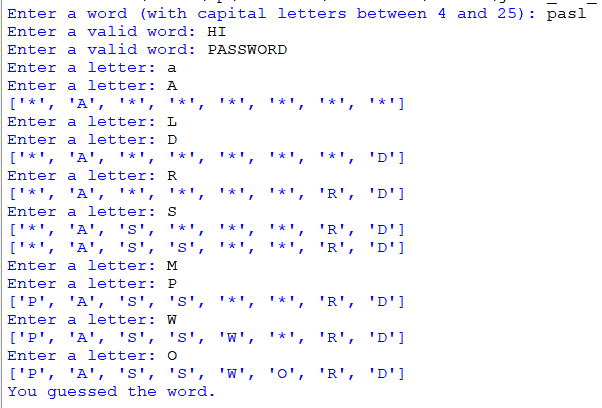

## Description
This program focuses on functionality rather than the traditional Hangman game itself. It allows users to input their own hidden word and enforces strict input validation for uppercase letters and word length. The game challenges players to guess the user-inputted word  with a maximum of 5 incorrect attempts.
## Example
♡ Example 1 :  
  
♡ Example 2 :  

